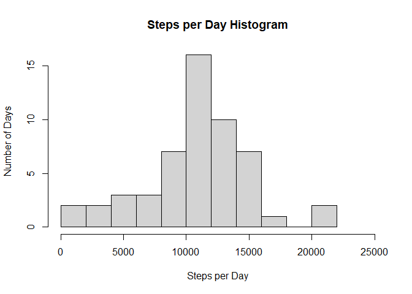
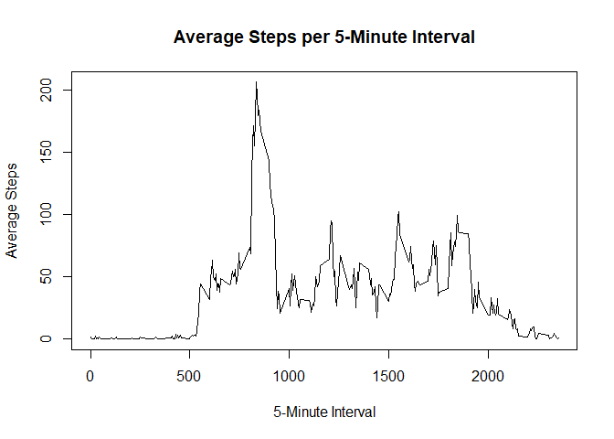
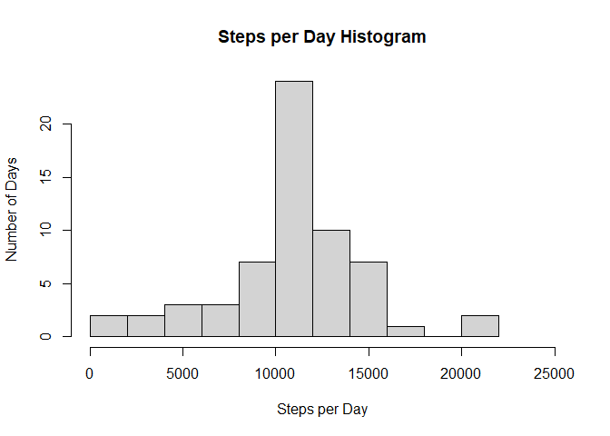
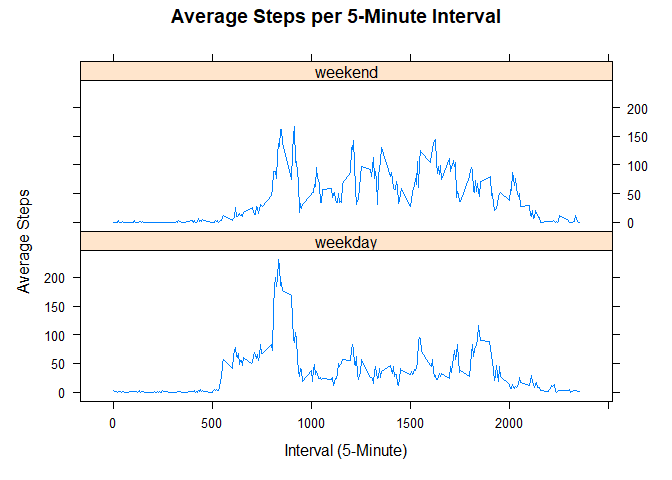

## Loading and preprocessing the data

```r
# Load libraries

library(dplyr)
library(lubridate)
library(lattice)
```


```r
# Load the activity data, removing any rows where the number of steps is "NA"

activityData <- read.csv("activity.csv")
```


## What is mean total number of steps taken per day?


```r
# Plot a histogram of the total number of steps per day

stepsPerDay <- na.omit(activityData) %>% group_by(date) %>% summarise(totalSteps = sum(steps))

hist(stepsPerDay$totalSteps, main = "Steps per Day Histogram", xlab = "Steps per Day", ylab = "Number of Days", breaks = 10, xlim = c(0,25000))
```

<!-- -->


```r
# Find the mean of the total number of steps taken per day (omit NAs from data set)

mean(na.omit(stepsPerDay$totalSteps))
```

```
## [1] 10766.19
```

```r
median(na.omit(stepsPerDay$totalSteps))
```

```
## [1] 10765
```


## What is the average daily activity pattern?


```r
# Find the average number of steps per day for each 5-minute interval (omit NAs from dataset)
avgIntervalSteps <- na.omit(activityData) %>% group_by(interval) %>% summarize(avgSteps = mean(steps))

# Plot
with (avgIntervalSteps, plot(interval,avgSteps, xlab = "5-Minute Interval", ylab = "Average Steps", main = "Average Steps per 5-Minute Interval", type = "l"))
```

<!-- -->


```r
# Find the time interval the contains the maximum number of average steps
avgIntervalSteps$interval[which(avgIntervalSteps$avgSteps == max(avgIntervalSteps$avgSteps))]
```

```
## [1] 835
```

## Imputing missing values


```r
# Find the number of NAs in the dataset
sum(is.na(activityData))
```

```
## [1] 2304
```


```r
# Copy of data set to modify with values for NA
activityDataRev <- activityData 

# Replace the NAs with the mean of that time interval
i = 1
for (steps in activityDataRev$steps) {
  
  initialSteps <- steps
  interval <- activityDataRev$interval[i]
  avgSteps <- round(avgIntervalSteps$avgSteps[which(avgIntervalSteps$interval == interval)],0)
  
  if (is.na(steps)) {activityDataRev$steps[i] <- avgSteps}
  
  i <- i+1
  
}
```


```r
# Histogram of the total number of steps per day

stepsPerDayRev <- activityDataRev %>% group_by(date) %>% summarise(totalSteps = sum(steps))

hist(stepsPerDayRev$totalSteps, main = "Steps per Day Histogram", xlab = "Steps per Day", ylab = "Number of Days", breaks = 10, xlim = c(0,25000))
```

<!-- -->


```r
# Find the mean and median of the total number of steps taken per day

mean(stepsPerDayRev$totalSteps)
```

```
## [1] 10765.64
```

```r
median(stepsPerDayRev$totalSteps)
```

```
## [1] 10762
```
### The mean and median of the total number of steps taken per day do not vary much from when the NA values are ignored to when the NA values are replaced, since the values were replaced with the means of the steps per interval.


## Are there differences in activity patterns between weekdays and weekends?


```r
# Create a factor variable for weekday and weekend

# Convert $date into Date format
activityDataRev <- activityDataRev %>% mutate(date = ymd(date))

# Find the day of the week for each date and Add a column for the factor weekday/weekend
activityDataRev <- activityDataRev %>% mutate(dayOfWeek = weekdays(activityDataRev$date), category = NA)

# Classify each day as a weekday or weekend
activityDataRev$category[which(activityDataRev$dayOfWeek == c("Monday"))] <- "weekday"
activityDataRev$category[which(activityDataRev$dayOfWeek == c("Tuesday"))] <- "weekday"
activityDataRev$category[which(activityDataRev$dayOfWeek == c("Wednesday"))] <- "weekday"
activityDataRev$category[which(activityDataRev$dayOfWeek == c("Thursday"))] <- "weekday"
activityDataRev$category[which(activityDataRev$dayOfWeek == c("Friday"))] <- "weekday"
activityDataRev$category[which(activityDataRev$dayOfWeek == c("Saturday"))] <- "weekend"
activityDataRev$category[which(activityDataRev$dayOfWeek == c("Sunday"))] <- "weekend"

# Convert category to a factor
activityDataRev <- transform(activityDataRev, category = factor(category))
```


```r
# Average steps per interval per weekend/weekday
newStepTable <- activityDataRev %>% group_by(interval,category) %>% summarize(avgSteps = mean(steps))

# Plot
xyplot(avgSteps ~ interval | category, data = newStepTable, layout = c(1,2), type = "l", main = "Average Steps per 5-Minute Interval", xlab = "Interval (5-Minute)", ylab = "Average Steps")
```

<!-- -->
